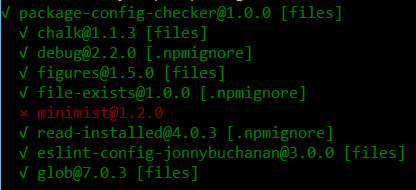

# Package Config Checker

[![npm package][npm-badge]][npm]

Tells you things about your dependencies and transitive dependencies.

## Usage

```
npm install -g package-config-checker
```
```
Usage: package-config-checker <show> [options]

Options:
  -h, --help     display this help message
  -d, --depth    max depth for checking dependency tree (default: ∞)

Show:
  -f, --files    show presence of files config or .npmignore
  -r, --recent   show recently updated dependencies
```

## Show Flags

You must specify at least one thing to show.

### `-f, --files`

Checks if your npm dependencies (and transitive dependencies) have [`files` config in `package.json`](https://docs.npmjs.com/files/package.json#files) or have an [`.npmignore` file](https://docs.npmjs.com/misc/developers#keeping-files-out-of-your-package) to avoid including unnecessary files when your module is being packaged for publishing to the npm registry.

Since [npm automatically whitelists certain essential files and blacklists common files which should not be included in module packages](https://docs.npmjs.com/files/package.json#files) (such as source control directories, `npm-debug.log` and `.DS_Store`), submitting a Pull Request to one of your dependencies to add a `files` whitelist to its `package.json` is a quick and easy way to reduce the size of your - and everybody else's - `npm install`.

### `-r, --recent`

Shows the 10 most recently published dependencies - use this if you have a hunch you just got broken by a transitive dependency.

## Example

Checking `package-config-checker`'s own direct dependencies as an example:

```
$ package-config-checker -f -d 0
```


`minimist@1.2.0` has been flagged as not having any configuration to control publishing.

Let's look at what was included in its npm packge:

```
$ ls -a node_modules/minimist/
./   .travis.yml  index.js  package.json     test/
../  example/     LICENSE   readme.markdown

```

It includes `example/` and `test/` directories, and a Travis CI config file, which most likely aren't required to use minimist. These take up an additional 18.2 KB of space, which isn't really a big deal in absolute terms.

Let's package the module up again and rename the resulting file so we can compare later.

```
$ cd node_modules/minimist/
$ npm pack
minimist-1.2.0.tgz
$ mv minimist-1.2.0.tgz minimist-1.2.0-pre.tgz
```

Now let's add suitable `files` config to `package.json`:

```json
  "files": [
    "index.js"
  ],
```

If we repackage the module, npm will now use the `files` config.

Listing the contents of the new package shows an example of the default files npm whitelists in addition to the module-specific whitelist we provided:

```
$ npm pack
minimist-1.2.0.tgz
$ tar -tf minimist-1.2.0.tgz
package/package.json
package/LICENSE
package/index.js
package/readme.markdown
```

Now we can compare the before and after size of the package which would be published to npm:

```
$ ls *.tgz -l | awk '{print $9,$5}'
minimist-1.2.0.tgz 4300
minimist-1.2.0-pre.tgz 7984
```

That's approximately 3.6 KB less to download.

The bandwith and `node_modules/` savings in this example are fairly insignificant per install, but at the time of writing minimist has been downloaded from npm *27,095,636* times in the last month.

The reduced package size would have resulted in a *93GB* bandwith saving for the npm registry for that number of downloads.

Now that we've done the research, the final step is to [create a Pull Request](https://github.com/substack/minimist/pull/88) with the packaging config changes.

You can do this by editing `package.json` directly from the GitHub UI, which will fork the project for you in the background and let you create a Pull Request at the same time.

## MIT Licensed

[npm-badge]: https://img.shields.io/npm/v/package-config-checker.png
[npm]: https://www.npmjs.org/package/package-config-checker
